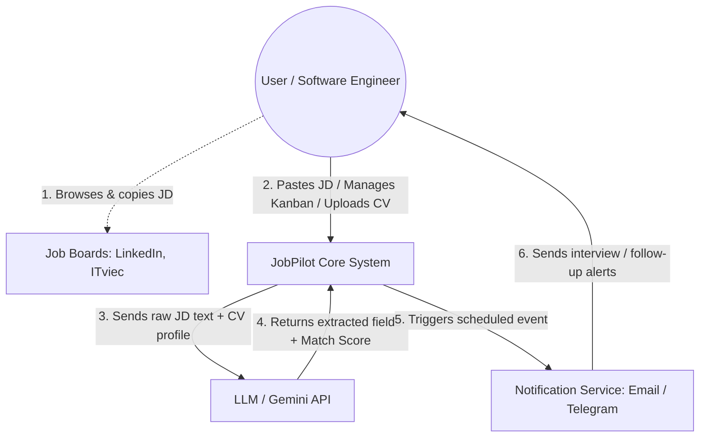

# System Design Drill: JobPilot Context & Data Flow

## 1. System Context Actors

- **User (Software Engineer):** The primary actor interacting with the system to manage their job-hunt pipeline.
- **JobPilot (Core System):** The central application handling business logic, data persistence, and orchestration.
- **External System 1 - Job Boards (LinkedIn, ITviec, etc.):** The primary data source where the user finds Job Descriptions (JDs).
- **External System 2 - LLM (Gemini API):** The AI engine responsible for extracting structured fields from raw HTML/text and calculating vector-based match scores between CVs and JDs.
- **External System 3 - Notification Service (SendGrid / Telegram):** The delivery mechanism for sending asynchronous reminders.

## 2. Core Data Flow Diagram

Below is the Mermaid flowchart representing the high-level data flow across the actors and systems:

## 3. Data Flow Explanation (Step-by-Step)

### Sourcing

The User browses external Job Boards and copies the link or raw text of a Job Description. (Note: In the MVP phase, this is a manual copy-paste action. In the M11 scaling phase, this might be replaced by an automated crawler).

### Ingestion & Interaction

The User inputs the raw JD into JobPilot. The user also interacts with the system to drag-and-drop applications on the Kanban board.

### AI Processing Request

JobPilot asynchronously dispatches the raw JD and the user's CV to the LLM.
AI Response: The LLM parses the unstructured text, returning structured arrays (skills, requirements) and calculating the semantic similarity score (Vector Embeddings) back to JobPilot.
Event Scheduling: Based on the application status (e.g., "Interviewing"), JobPilot pushes a scheduled task/trigger to the Notification Service.
Alerting: The Notification Service delivers the reminder back to the User so they never miss a follow-up.
